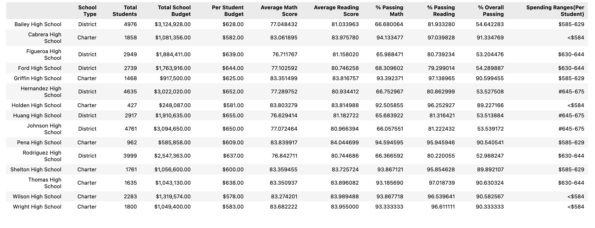
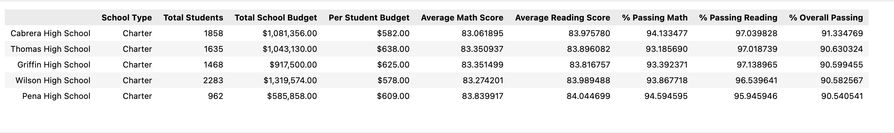
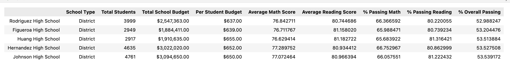
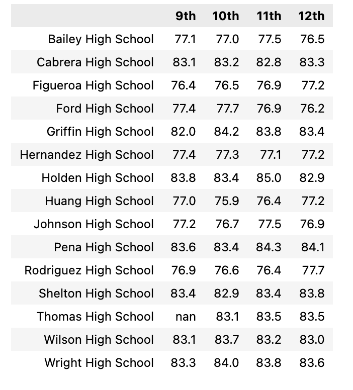
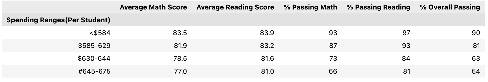
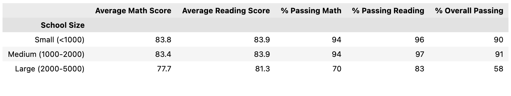
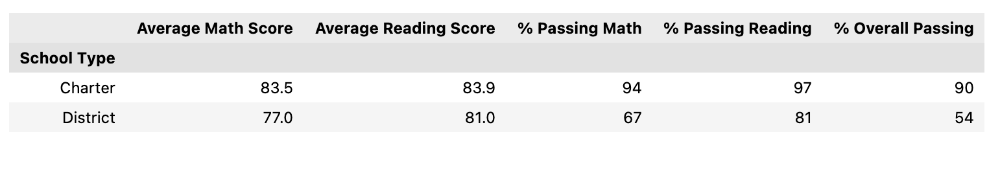
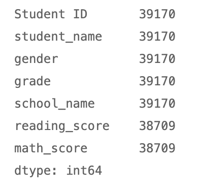
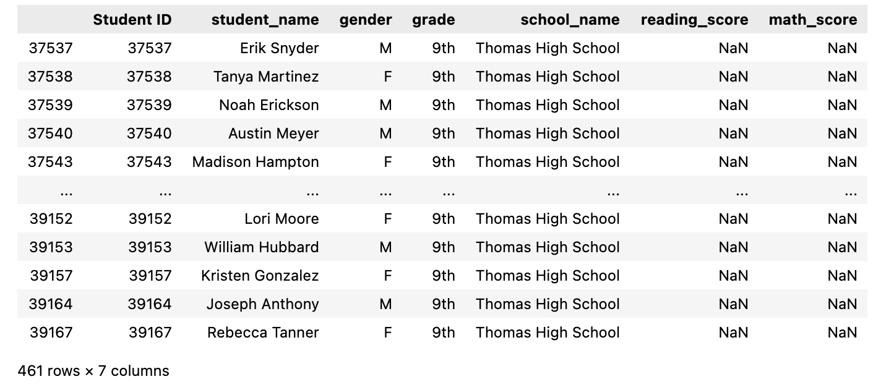

Overview of the school district analysis: 
Maria has asked me to analyze the school data she has provided based on the following points:

- A high-level snapshot of the district's key metrics is as shown below

Top 5 performing schools, based on the overall passing rate

Bottom 5 performing schools

The average math score received by students in each grade level at each school

The average reading score received by students in each grade level at each school

School performance based on the budget per student

School performance based on the school size 

School performance based on the type of school

Results: 
How is the district summary affected?

How is the school summary affected?

How does replacing the ninth graders’ math and reading scores affect Thomas High School’s performance relative to the other schools?
Overall Thomas High School was still scuccessful to be listed in the top 5 schools.

Summary: Summarize four changes in the updated school district analysis after reading and math scores for the ninth grade at Thomas High School have been replaced with NaNs.
