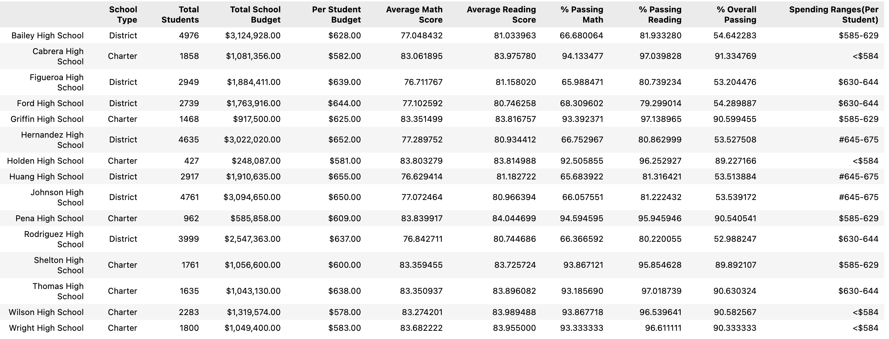

# Overview of the school district analysis

 Maria has asked me to analyze the school data she has provided based on the following points listed.

A high-level snapshot of the district's key metrics is as shown below

Top 5 performing schools based on the overall passing rate

Bottom 5 performing schools based on the overall passing rate

The average math score received by students in each grade level at each school

The average reading score received by students in each grade level at each school

School performance based on the budget per student

School performance based on the school size 

School performance based on the type of school

## Results: 
How is the district summary affected?

Total number of students for the complete district is 39170 and dropping math-reading scores of 461 students at 9th grade of a single high school impacted all of them.

How is the school summary affected?

How does replacing the ninth graders’ math and reading scores affect Thomas High School’s performance relative to the other schools?

Overall Thomas High School was still scuccessful to be listed in the top 5 schools.

Summary: 
1. Removing 9th grades math and reading scores in Thomas High School reduced the total number count by 461 count overall. This high school still was successful to be at the top 5 school list. 
2. Taking off 461 students from Thomas High School overall impacted the school in its own calculations.
3. All top 5 schools are charter type versus district type. This might be further discussion by the education board for areas of improvement.
4. Based on the specific reports provided, education board can look further into each school group size and budget, identify what has been efficient an affective to bring success to students.
